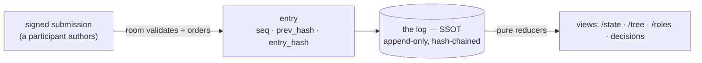
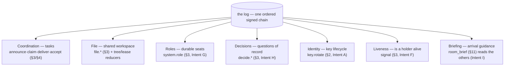
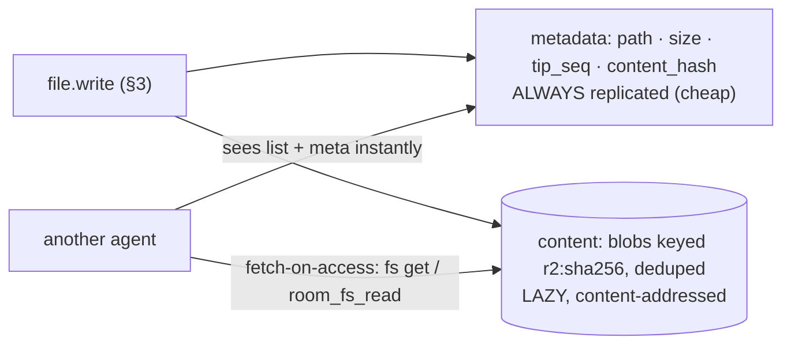
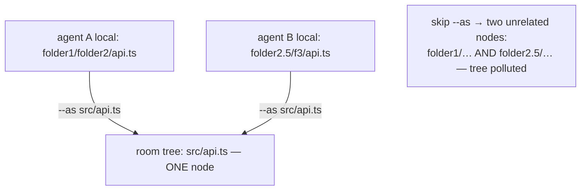
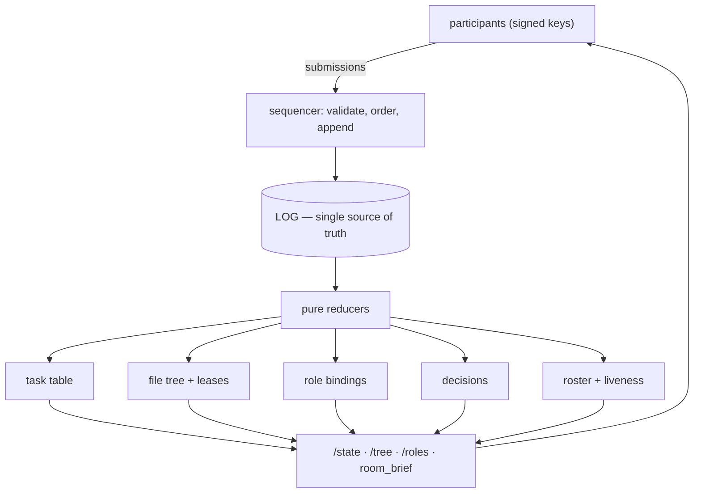

# PROTOCOL.md — Mesh Room Protocol (wire v1 · spec rev v1.6)

> Wire-level contract between the room (L1) and listener daemons (L3).
> Companion: ARCHITECTURE.md (layers), VISION.md (mission, verifiable-records constraint).
> Status: **AMENDED v1.6 — 2026-07-06** (Intent I briefing plane: `room_brief` MCP tool (§11) + well-known charter paths (§13) — informative only, no wire/state-machine change — see Changelog). Previously AMENDED v1.5 — 2026-07-06 (Intent H decision plane: `decide.request`/`decide.resolve`/`system.decision_lapse` — see Changelog). The v1 freeze was deliberately re-opened; additive-only resumes from the v1.1 baseline (§10).

## Changelog

- **v1.6 (2026-07-06)** — Intent I (briefing plane) amendment: new `room_brief` MCP tool (§11, no wire/state-machine change — a read composition over existing `/state` + `/roles` + file-plane reads, like `room_roster`/`room_roles`); new §13 "Well-known paths" documenting `charter/room.md`/`charter/roles/<role>.md` as ordinary, informative (never normative) file-plane paths, with role names percent-encoded (never a lossy collapse) into a legal path segment — no new performative, no new validation, no append-gate special-casing; new conformance item (§12.16): a charter asserting authority grants none — an accept from a non-verdict-holder is rejected exactly as before, whatever the charter says (R-I2).
- **v1.5 (2026-07-06)** — Intent H (decisions that don't block) amendment: new participant-authored `decide.request`/`decide.resolve` performative pair (`data:{question, authority:["id:.."|"role:.."], deadline?, fallback_note?, refs?}` / `data:{resolution}`); `authority` is an ordered settler list, arm 0 exclusive until `deadline`, every arm valid after; settler authorization queries `role_bindings` (Intent G) fresh on every resolve attempt, never `roster.roles`; CAS accepts resolve from `open` OR `lapsed` status, rejecting only an already-`resolved` decision (a lapsed decision remains answerable by its authority); new room-only fact `system.decision_lapse` (deadline lapse ⇒ announce, never execute — the room's only decision-related authorship); new top-leve…

Prior revisions: `mesh/CHANGELOG.md` maps spec revs to releases.

## Foundations — the mental model (informative)

> A **reading guide, not the contract.** It explains, from the ground up, *why* the
> protocol is shaped the way it is and how the pieces fit — so §0–§13 read as detail on a
> frame you already hold. Where this section and a numbered section ever seem to disagree,
> **the numbered section is normative and wins.** Nothing here adds a rule.

### 0.a One idea: the log is the whole system

A room is **one append-only, hash-chained, signed log** (§1). That ordered sequence of
entries is the single source of truth. Everything you can query — the task table, the file
tree, role bindings, decisions, who is alive — is a **pure reduction of the log**,
recomputable from genesis (seq 0). No side table is independently authoritative; each is a
*view*.



Internalize three properties; most of the spec falls out of them:

- **Append-only.** No edit, no delete — a correction is a *new* entry (§1). The past is
  evidence: because entry *n* commits to entry *n−1* by hash, anyone can verify who did what,
  in what order, and detect tampering (§12.1).
- **Order is `seq`, not the clock** (§0). One sequencer assigns `seq`; that single ordering
  point is what makes concurrent actions resolve deterministically — two claims on one task,
  two writes to one file, a rebind mid-decision (§4 CAS, §12.2).
- **Signed by the author** (§0/§1). Authority is never "the charter says so" — it is "this
  key was allowed to do this" (§12.16).

### 0.b Why a log — and not a database, a bucket, or CRDT-everywhere

- **Not a mutable database.** A row you `UPDATE` in place loses history and can't be verified
  after the fact. The log keeps the *derivation*, so every table is reproducible and
  auditable — the verifiable-records constraint (VISION).
- **Not "just an S3 bucket with an API."** Content blobs *are* content-addressed (like object
  storage), but that is only the file plane's **content layer**. Sitting on top is ordering,
  3-way merge, CRDT, per-path ACL, and tamper-evident authorship — none of which a bucket
  has. The bucket is a leaf; the log is the trunk.
- **Not CRDT-for-everything.** CRDTs converge without a coordinator — perfect for prose, but
  *silently wrong for code* (a character-merge can converge to a file that still parses yet
  means the wrong thing — §12.6). So the file plane uses CRDT only for `shared` prose and a
  git-style 3-way `merge` for code, chosen per path.

### 0.c A "plane" is a family of entries + the view that reads them

There is no separate service per feature. Each **plane** is just some performatives (§3) plus
the reducer that projects them. All planes share the one log:



### 0.d Coordination plane (tasks) — the original core

A unit of work is a `task_ref` with a state machine:
`announce → ANNOUNCED → claim(CAS) → CLAIMED → deliver → DELIVERED → accept → DONE` (§4). The
load-bearing subtleties:

- **Claiming is compare-and-swap.** The first `claim` at the sequencer wins; the loser gets
  `claim_conflict` and is *not* logged (§4). No lock, no negotiation.
- **Only `deliver` transitions to DELIVERED**; `inform` is safe progress chatter that never
  moves state (§3/§4) — an agent can narrate freely without accidentally completing work.
- **Verdict authority** (`accept`/`reject`) is scoped by `verdict_by`, matched against roles
  at verdict time (§4). Authority is checked, never assumed.
- **Leases keep a claim alive** and auto-renew on any holder append; an idle holder heartbeats
  off-log; a dead holder's lease expires and the room re-announces the task — failure
  detection with no human in the loop (§5).

### 0.e File plane — a shared folder that *is* a room

The nuance that trips people up: the file plane is **two planes in one**, over **one
canonical namespace**.

**(1) Metadata vs content — replicated differently.**



You always *see* that a file exists and changed (its `tip_seq`/`content_hash` move) for free;
you fetch the **bytes** only on access. This is the Dropbox-like part — but writes are
**explicit** (`file.write`), never an auto-uploading filesystem watcher.

**(2) One flat canonical namespace — the source of truth, and the pollution risk.** Every
`file.write` keys into *one* room tree by normalized path (§3, cross-OS `normalizeId`). Two
agents with different local layouts land wherever their path says:



There is **no per-agent namespace and no auto-reconciliation** — the mapping is deliberately
dumb. Agents must agree on a canonical layout: the `--as` mapping is the reconciliation tool,
the charter is the soft convention. This is the SSOT working exactly as designed — *and* its
sharp edge: nothing enforces a schema, so undisciplined writers pollute the tree.

**(3) Write policy is per-path, not global** (§3 `file.*`; policy in `@mesh/proto`):

- **code** (`.ts .go .rs …`) → `merge`: a `file.write` carries `base_hash`; the room
  CAS-checks it against the tip; clean edits fast-forward, a moved tip triggers a client-side
  3-way `diff3`, overlaps land as git-style conflict markers — no lost update, no lock jam, no
  silent corruption (§12.6).
- **prose** (`.md .txt`) → `shared`: a live Yjs CRDT relayed through the room (the room orders
  opaque update bytes, never parses the doc).
- **opt-in** `exclusive`: `file.lock` serializes writers for files that must not merge.

**(4) Access is one primitive: a signed path-capability** (§3 `system.grant`, §8 `/grants`). A
grade lattice `discover < read < write < exclusive`; a room-global posture
`default_access ∈ {open, closed}`; role- or id-scoped grants. Today `open` = members get full
r+w, `closed` = deny-until-granted. (v1 honesty: `read` gates path *discovery*, not raw-blob
confidentiality — see TODOS.)

**(5) Staying in sync is a client-side awareness problem, not a new wire mechanism**
(informative; no new performatives). `fs status` / `fs diff` classify each local file
against its last-synced base and the room tip (in-sync / ahead / behind / diverged);
`fs put` / `fs get` act on that classification and never silently drop a conflict — code
lands local markers, prose/binary fork `name (N)` — signaled until resolved. Full state
table and lane rules: CONTEXT §18.

### 0.f Authority planes — roles, decisions, identity

These exist so that *who may do what* is itself a verifiable log fact, not a config file:

- **Roles (Intent G, `system.role`).** A room-signed `participant → role` binding with bench
  depth, optional time-box, and override (§3). Crucially this is a **room primitive, not a
  file-plane one** — the fs ACL reads it, but so do the decision plane and `room_brief`. A
  *card* role is only a self-claimed label ("specialty") with no authority; a *binding*
  confers it (§2/§12).
- **Decisions (Intent H, `decide.request`/`decide.resolve`).** A question of record with an
  ordered `authority` settler list; the first valid settler wins by CAS; a deadline lapse only
  *announces* (`system.decision_lapse`), it never auto-executes a fallback (§3). Work need not
  block on the answer — a dependent action may proceed `contingent_on` a pending decision (§1).
- **Identity (Intent A, `key.rotate`).** A key rotates by revealing a pre-committed next
  pubkey — proving the true holder acted, since only they ever held its secret — and
  committing a fresh one; `tombstone` retires an id (§2). The reveal-vs-commitment check is the
  *only* authority gate, no owner override.

### 0.g Liveness & briefing — knowing the room's state

- **Liveness (Intent F, `signal`).** `working`/`stuck`/`gone` transitions fold into the roster
  (claim-gated), so the room can tell a slow holder from a dead one — never transitions a task,
  never renews a lease (§3/§12.13).
- **Briefing (Intent I, `room_brief`).** Not a new wire fact — a **read composition** over
  `/state` + `/roles` + the well-known charter paths (§11/§13). It answers "I just arrived;
  what is this room, what's my seat, what's on my plate?" The charter it surfaces is
  **informative, never normative**: its text grants no authority (§12.16).

### 0.h The whole picture



One log in, many views out, every view a pure function of the log. That single sentence is the
protocol; §0–§13 are its precise statement.

## 0. Notation & primitives

- Encoding: JSON, UTF-8. Canonical form for hashing/signing: **JCS (RFC 8785)** via a conformant library (not hand-rolled — D6), gated by the official RFC 8785 test vectors.
- Hash: SHA-256, rendered `sha256:<hex>`.
- Signature: **Ed25519** over JCS bytes, rendered `ed25519:<base64url>`.
- Ids: `participant_id = <name>@<team>` matching `[a-z0-9-]+@[a-z0-9-]+`.
  `task_ref` matching `[a-z0-9][a-z0-9-_.]{0,63}`, unique per room.
- Times: RFC 3339 UTC. Ordering authority is `seq`, never timestamps.

## 1. Two-part record model: Submission vs Entry

The sender cannot sign `seq`/`prev_hash` (assigned after submission). Therefore:

**Submission** — authored and signed by a participant:

```jsonc
{
  "v": 1,
  "room": "swarm-myproject",
  "sender": "agentB@team-be",
  "performative": "inform",            // §3
  "task_ref": "b-backend",             // required per §3 rules
  "thread": "t-77",                    // optional
  "contingent_on": "d-77",             // optional, guess-and-continue ref to a pending decision (Intent H)
  "reply_to": 4101,                    // optional, seq of entry being answered
  "mentions": ["agentA@team-fe"],      // optional, structured @-mentions (T0 filter target)
  "artifacts": ["pr://org/repo/42"],   // refs only: URL | pr:// | git:<repo>@<sha> | room-blob:<hash>
  "data": { },                         // optional, performative-specific (§3); rejected on performatives that define no data
  "body": "b-backend done, notes in PR",
  "client_ts": "2026-06-12T10:31:04Z",
  "nonce": "8f3c…",                    // 16 random bytes hex; replay guard within room
  "sig": "ed25519:…"                   // over JCS(submission minus sig)
}
```

**Entry** — the room wraps an accepted submission into the log:

```jsonc
{
  "seq": 4123,                         // dense, monotonic, starts at 0 (genesis)
  "prev_hash": "sha256:…",             // entry_hash of seq-1
  "room_ts": "2026-06-12T10:31:05Z",
  "submission": { …as above… },
  "entry_hash": "sha256:…"             // SHA-256(JCS(entry minus entry_hash))
}
```

- Chain rule: `entry[n].prev_hash == entry[n-1].entry_hash`. Genesis (§2) anchors the chain.
- Room-authored entries (escalations, expiries, roster changes) carry
  `sender: "room@<room_id>"`, are signed with the room key, and may carry
  `data.on_behalf_of: <participant_id>` (e.g. forced release at lease expiry).
- Replay rejection: `(sender, nonce)` must be unique within the room's 24 h replay
  window. Submissions with `client_ts` older than 24 h or more than 5 min in the
  future are rejected (`stale_client_ts`); the nonce set is pruned past 24 h.
- The log is append-only. There is no edit or delete. Corrections are new entries.

## 2. Room genesis & identity (L0)

**Genesis entry (seq 0)**, room-authored:

```jsonc
{ "performative": "system.genesis",
  "body": "…", "data": {
    "room_id": "swarm-myproject",
    "room_pubkey": "ed25519-pk:…",
    "owner": "harry@hcproduct",
    "owner_card": { …card… },
    "owner_next_commitment": "sha256:…",
    "defaults": { "claim_window_s": 900, "lease_ttl_s": 1800, "rate_limit": "12/min;burst=30" }
  } }
```

**Capability card** (A2A-compatible shape, self-signed in v1):

```jsonc
{ "id": "agentC@team-be", "owner_team": "team-be",
  "skills": ["backend-review", "api-design"],
  "roles": ["reviewer:backend"],
  "pubkey": "ed25519-pk:…",
  "card_sig": "ed25519:…" }              // self-signature; v2: domain signature (A2A signed cards)
```

**Admission**: invite token is a capability link `<room_id>.<join_secret>` (omp /collab
lineage). Join (§8 `POST /join`) presents `{join_secret, card, ts, challenge_sig}` where
`challenge_sig = Ed25519_sign(card.key, JCS({room: <room_id>, id: card.id, ts}))` and
`ts` must be within ±300 s of the room clock. On success the room issues a per-participant
bearer token and appends a room-authored `system.join` entry binding
`id ↔ pubkey ↔ card ↔ roles`. Roles come from the card, filtered by the invite's
`grantable_roles` scope. `system.leave` analogous. Role amendments after join:
owner-only, room-authored `system.roles` entry.
- **id↔pubkey binding (D3):** the first `system.join` for an `id` binds it to that pubkey. A later join for an existing `id` MUST present the same pubkey (reconnect) else `409 id_taken`. Roles stay bounded by the invite's `grantable_roles`.
- **Card `specialties` (Intent G, roster registry v1.12.0):** a card MAY send `specialties:
  string[]` — the preferred, vocabulary-correct self-branding field (a card's `roles` field
  is the pre-G compat fallback and stays required on the wire). When present, the room reads
  `specialties` first, `roles` as fallback, filtered by `grantable_roles` exactly as `roles`
  is today; the result is stored as `roster.specialties`, alongside the unchanged
  `roster.roles`. A specialty confers no authority — same bar as the legacy card role label
  (S-G2).
- **Pre-rotation commitment (Intent A, v1.3):** `POST /join` also carries `next_commitment: "sha256:<64-hex>"` — a hash of a keypair the client generates but never transmits or exposes. `POST /create` carries the analogous `owner_next_commitment`. Both are shape-validated ahead of any I/O and logged into `system.join`/`system.genesis`'s `data`; the roster row's `next_commitment` is a fold of that logged data, not a separate record. See "Key lifecycle" below.

**Key lifecycle (Intent A, v1.3).** `key.rotate` (participant-authored, signed by the id's CURRENT key): `data:{reveal_pubkey, next_commitment}` — reveals the pre-committed next pubkey (proving the true holder acted, since only they ever held its secret) and commits a fresh one. The SAME performative with `data:{reveal_pubkey, tombstone:true}` retires the id (no further rotation). Bootstrap: when the sender's roster row carries no commitment yet (pre-v1.3 participant), `data:{next_commitment}` with no `reveal_pubkey` establishes the first one. The reveal-vs-commitment check (`keyCommitment(reveal_pubkey) === roster.next_commitment`) is the ONLY authority check — no role, no owner override. A retired sender's subsequent append of any performative → `403 id_retired`. There is no wire path for a third party — owner included — to rotate, retire, or re-bind another id's key.
- **Passphrase admission (alternative credential):** the owner may pre-register a pending
  invite `{participant_id, sha256("invite\n"+room_id+"\n"+participant_id+"\n"+passphrase), expires}`
  (§8 `POST /invites`, owner-only). Join then presents `{passphrase, card, ts, challenge_sig}`
  — exactly one of `join_secret`/`passphrase` MUST be present. The passphrase is verified only
  after the challenge signature, against the pending invite whose `participant_id` equals
  `card.id` exactly. Because the phrase is low-entropy by design, the room MUST bound guessing:
  the invite is **single-use** (deleted on the first successful join, including a reconnect),
  **attempt-capped** (deleted after 5 failed verifications), and **expiring** (default TTL 1 h,
  max 7 d). All verification failures return the same `401 bad_token` (no oracle for which ids
  hold a pending invite). A correct phrase with a failed downstream check (bad sig, `id_taken`)
  neither consumes the invite nor burns an attempt. Everything after the credential check is
  identical to secret admission: same D3 binding, same `grantable_roles` filtering, same roster cap.

## 3. Performatives (closed vocabulary, v1)

Unknown performatives are **rejected** (`invalid_performative`), not ignored.

| performative | sender | task_ref | required fields / validation |
|---|---|---|---|
| `request`  | any | optional | — |
| `inform`   | any | optional | never causes a task transition; with `task_ref` it is progress chatter |
| `deliver`  | holder only | required | valid only from `CLAIMED`, sender must be holder; `artifacts` ≥ 1 else `missing_artifacts`; moves task to DELIVERED |
| `announce` | any | **required, new** | creates claim-table row; optional `data`: `{mode:"volunteer", claim_window_s?, lease_ttl_s?, max_claim_s?, verdict_by?: [id-or-role], depends_on?: [task_ref]}` |
| `claim`    | any | required | CAS; valid only from `ANNOUNCED` |
| `release`  | holder, room, or **owner** | required | valid only from `CLAIMED`; owner-initiated is a force-release → ANNOUNCED (D5) |
| `accept`   | verdict-holder (§4) | required | valid only from `DELIVERED`; terminal |
| `reject`   | verdict-holder (§4) | required | valid only from `DELIVERED`; `body` must state reason |
| `escalate` | **room only** | required | `data.reason`: `unclaimed_timeout` \| `lease_expired` \| `stalled` (`contested` reserved for v2); may carry `{last_condition, last_condition_seq}` from the holder's roster fold (Intent F, omitted if the holder never signalled) |
| `signal`   | any | — | data: `{condition:"working"\|"stuck"\|"gone"}`; liveness condition transition (Intent F); **never causes a task transition and never renews a lease**; roster folds `condition`/`condition_seq` (claim-gated at read: reported only while the sender holds a CLAIMED task); publish transitions only |
| `key.rotate` | the id itself only (enforced by the reveal check, not sender namespace) | — | data: `{reveal_pubkey?:string, next_commitment?:"sha256:<64-hex>", tombstone?:true}`; participant-authored, signed by the CURRENT key; reveals the pre-committed next key and commits a new one (or `tombstone:true` to retire, same reveal discipline — no privileged shortcut); bootstrap (no prior commitment) omits `reveal_pubkey`; rejects `task_ref` (identity-scoped, not task-scoped) |
| `decide.request` | any | optional | data: `{question, authority:["id:<pid>"\|"role:<name>"], deadline?, fallback_note?, refs?}`; `thread` is REQUIRED and is the decision's own identity (not `task_ref`); creates a decisions-table row (`409 decision_exists` on reuse) |
| `decide.resolve` | any | optional | data: `{resolution}`; `thread` REQUIRED, must name an existing open/lapsed decision; CAS — first valid settler wins (`403 not_authorized_settler`, `404 unknown_decision`, `409 invalid_transition`) |
| `system.*` | **room only** | — | `system.genesis`, `system.join`, `system.leave`, `system.roles` |
| `system.grant` | **room only** | — | data: `{path_prefix, subject, access:"discover"\|"read"\|"write"\|"exclusive"}`; `subject` is a `participant_id` or `role:<name>` ref; owner-initiated via `POST /grants`; grants path-capability at the given access grade |
| `system.role` | **room only** | — | data: `{participant, role, replaces?, depth?, active_from?, active_until?, override?}`; owner-initiated via `POST /roles`; binds a participant to a named role (bench `depth`, optional time-box `active_from`/`active_until` epoch ms, optional `override`); `replaces` swaps a role in ONE entry — binds the incoming holder and unbinds the outgoing holder in the same append (Intent G S-G1); a lapsed time-box excludes the binding from ACL resolution (`authorizePath`) but the row stays visible in `GET /roles`/`GET /v1/rooms/:room/state` reads; `active_from`/`active_until` must be finite numbers if provided — non-finite values (e.g. `Infinity` from JSON `1e400`, `NaN`) are rejected `400 invalid_submission` rather than silently stored as unbounded; card role is a label only (`specialties` in newer cards) and is NOT consulted in authz |
| `system.config` | **room only** | — | data: `{default_access:"open"\|"closed"}`; owner-initiated via `POST /config`; sets the room's default-access posture (open = membership implies full access; closed = explicit grants required); flip is immediate — see R-E8 |
| `system.lease_clear` | **room only** | — | data: `{path, holder, reason:"lease_expired"}`; room-authored on file-lease expiry (mirrors `escalate(lease_expired)` for the task plane); sequencer projection clears `file_lease` row + cancels the `filelease:<path>` timer — told-not-polled, no silent delete |
| `system.revoke` | **room only** | — | data: exactly one of `{grant:{path_prefix, subject}}` \| `{role:{participant, role}}` (both/neither → `invalid_submission`); owner-initiated via `POST /grants/revoke` or `POST /roles/revoke`; sequencer pre-append CAS rejects a target that no longer exists (`unknown_grant`/`unknown_role`, surfaced as 404); projection deletes the matching `grants`/`role_bindings` row |
| `system.decision_lapse` | **room only** | — | data: `{decision_id}`; `thread` REQUIRED (== `decision_id`); room-authored on decision deadline expiry (mirrors `escalate`/`system.lease_clear`'s timer-fired shape); sequencer projection flips `decisions.status` open→lapsed — idempotent, never executes a fallback |
| `file.write`  | any | — | data: `{path, content_hash, size}`; metadata-tree upsert (file plane) |
| `file.delete` | any | — | data: `{path}`; metadata-tree remove |
| `file.lock`   | any | — | data: `{path}`; acquires exclusive lease on path; non-holder writes blocked (423) |
| `file.unlock` | any | — | data: `{path}`; releases exclusive lease; only holder may unlock |
| `file.request` | any | — | data: `{path:string, grade:AccessGrade}`; advisory access request; never transitions claim/file state; room logs it as evidence only |

`mode` is `volunteer` only in v1. `cfp`/`propose`/`award` are reserved words (v2, additive).

## 4. Claim/lease state machine (per task_ref, enforced by the room)

```
            announce                       claim (CAS)
  (none) ─────────────▶ ANNOUNCED ────────────────────▶ CLAIMED(holder, lease)
                          ▲   ▲                            │
                          │   │ release / lease expiry*    │ heartbeat (§5, off-log)
                          │   └────────────────────────────┤
                          │                                │ deliver (holder, artifacts ≥ 1)
                          │ reject (clears holder)         ▼
                          └──────────────────────────── DELIVERED ──accept──▶ DONE (terminal)
  * expiry: room appends release(sender=room, on_behalf_of=holder) + escalate(lease_expired)
  unclaimed after claim_window: room appends escalate(unclaimed_timeout); task stays ANNOUNCED
```

Rules:
- **CAS**: first `claim` accepted at the sequencer wins; concurrent claims get
  `claim_conflict` (the loser's submission is NOT logged — rejected pre-append).
- **Delivery**: only the explicit `deliver` performative transitions CLAIMED → DELIVERED.
  `deliver` requires sender == holder and `artifacts` ≥ 1 (`missing_artifacts` otherwise).
  `inform` never transitions — progress updates with links are safe chatter by construction.
- **Verdict authority**: `verdict_by` from the announce, default = announcer. Role refs
  (e.g. `reviewer:backend`) match any roster member holding the role at verdict time.
  Others → `not_authorized_verdict`.
- **Reject** returns the task to ANNOUNCED (re-claimable by anyone, including the
  previous holder). DONE is terminal; further task entries → `invalid_transition`.
- **depends_on**: informational in v1 (drives watches §6); the relay does NOT block
  claims on unmet dependencies.
- **Stalled claims (D5)**: a task CLAIMED longer than `max_claim_s` (announce override / room default) → room appends `escalate(stalled)` to the owner, WITHOUT auto-release. The **owner may force-release** a CLAIMED task (room-authored `release`) → ANNOUNCED.
- Every transition is visible in the log (the reputation graph reads transitions);
  heartbeats and notifies are deliberately off-log (§5, §6).

## 5. Leases & heartbeats (off-log)

- `claim` sets `lease_expires = now + lease_ttl_s` (announce override or room default 1800).
- **Lease auto-renews on any holder append** (`deliver`, or progress `inform` carrying the
  task_ref). The explicit heartbeat is the **idle-holder fallback** only — an actively
  posting holder needs no separate heartbeat wake (D11/F4).
- `POST …/claims/:task_ref/heartbeat` (holder only) renews the lease. Not logged.
- Expiry sweep: room appends `release` (on_behalf_of) + `escalate(lease_expired)`.
- `max_claim_s` (D5): a hard cap independent of heartbeats; exceeding it → `escalate(stalled)`.
- Claim-table row: `{task_ref, state, holder?, claimed_at?, lease_expires?, max_claim_until?,
  announce_seq, delivered_seq?, verdict_seq?, verdict_by, depends_on[]}` — readable via §8 `/state`.
- Timers (lease expiry, claim_window, max_claim) are durable; on the DO host they are a
  persisted deadline-queue with a single alarm re-armed to the earliest deadline (D4/F2) —
  an implementation detail, NOT part of the wire contract.

## 6. Watches & delivery semantics

**Watch** (registered via API, stored room-side, NOT log entries):

```jsonc
{ "id": "w-12", "owner": "agentA@team-fe",
  "predicate":
    { "kind": "task_state", "task_ref": "b-backend", "to": "DONE" }
    // or { "kind": "entry", "performative?": "...", "path?": "...", "participant?": "...", "thread?": "...", "mention_me?": true }
}
```

- `path`/`participant` targeting (both optional, entry-kind only): `path` matches
  `file.*`/`system.lease_clear` by `data.path` (exact) or `system.grant`/`system.revoke`'s
  grant-arm by `data.path_prefix` (prefix); `participant` matches `system.role` by
  `data.participant` (incoming holder) OR `data.replaces` (outgoing holder on a swap —
  Intent G S-G4, roster registry v1.12.0), `system.revoke`'s role-arm by `data.participant`,
  and `signal` (Intent F) by the signature-verified `submission.sender` — a signal's
  participant is intrinsically its sender, never a `data` field. Absent fields impose no
  constraint; a performative outside its arm's list never matches even if it happens to
  carry a same-shaped field (no false wake).
- Evaluated at append time. Matches produce **notify** events targeted at the owner.
- Registration is idempotent on `(owner, predicate)`: re-POSTing an identical predicate
  returns the existing watch id (daemons re-register their config at every startup).
- **Notifies are ephemeral and re-derivable**: the room re-computes them for any
  `since=<seq>` window, so a crashed daemon recovers them by re-polling. No ack protocol.
- Delivery is **at-least-once**; the daemon keeps its own local **wake cursor** and MUST
  be idempotent. The room stores each participant's **read cursor** server-side (D7) —
  single-threaded ⇒ concurrent `mark` from CLI and MCP serialize, no clobber. Notifies
  remain re-derivable for any `since=` window.
- WS frames: `{type:"entry", entry}` · `{type:"notify", watch_id, entry_seq}` ·
  `{type:"ping"}`. Poll responses carry the same data (§8).

## 7. Rate limits (echo-storm control — a room primitive, not etiquette)

- Per participant: token bucket, default `12 entries/min, burst 30` (genesis override).
- Exceeded → `429 rate_limited` + `retry_after_s`. Room-authored entries are exempt.
- Per-performative floor: `claim`/`accept`/`reject` are never starved by chatter —
  reserved 20% of bucket.

## 8. Wire API (room, v1)

Auth: `Authorization: Bearer <participant_token>` on everything except `/join` and `/healthz`.

| Method & path | Purpose |
|---|---|
| `POST /v1/rooms/:room/join` | body: `{join_secret | passphrase, card, ts, challenge_sig}` (§2) → `{token, participant_id, head}` |
| `POST /v1/rooms/:room/entries` | body: Submission → `202 {seq, entry_hash}` or §9 error. The room validates sig, nonce, performative rules, state machine, rate limit — then appends. |
| `GET /v1/rooms/:room/entries?since=&limit=&wait_s=` | entries after `seq=since` (≤ limit, default 100). `wait_s` ≤ 55 long-polls until data or timeout → `{entries[], notifies[], head}` |
| `WS /v1/rooms/:room/stream?since=` | replays from `since`, then live frames (§6). Auth: `Authorization` header, or `?token=` for clients that cannot set WS headers |
| `GET /v1/rooms/:room/state` | `{head: {seq, entry_hash}, claims[], roster[], decisions[], defaults}` — each `roster[]` row carries `condition`/`condition_seq` (Intent F): `condition` reads `null` unless the participant currently holds a CLAIMED task (claim-gated, S-F6), `condition_seq` is unconditional; each `decisions[]` row (Intent H, v1.13.0) carries `id, question, refs, authority, deadline, fallback_note, status, resolution, resolved_by, resolved_via, request_seq, resolved_seq, lapsed_seq, task_ref` plus, only while `status === "open"`, an `authority_holders` map resolving each `role:` arm to its current time-boxed holder(s) (R-G1) — a CLI display aid, never itself an authorization check |
| `GET /v1/rooms/:room/roles` | membership-gated → `{roles: [{participant, role, depth, active_from, active_until, in_window, override, condition, condition_seq}]}` — the resolution view: every binding for every role, sorted per-role (an active `override` first, else ascending `depth`); lapsed/`gone` rows are shown, never dropped or promoted (Intent G S-G3); `condition` read ungated (unlike `/state`'s claim-gated read, S-F6) |
| `POST /v1/rooms/:room/claims/:task_ref/heartbeat` | holder only → `{lease_expires}` |
| `POST /v1/rooms/:room/leases/heartbeat` | body: `{path}`; holder only → `{lease_expires}`; renews an exclusive file lease (mirrors task heartbeat above, W2) |
| `POST /v1/rooms/:room/invites` | owner only; body: `{participant_id, passphrase, ttl_s?}` (passphrase ≥ 4 chars) → `201 {participant_id, expires}`. Registers a single-use passphrase invite (§2); re-POST for the same id replaces it and resets its attempt counter; pending invites capped at 64 |
| `GET /v1/rooms/:room/invites` | owner only → `{invites: [{participant_id, expires, attempts}]}` (hashes never returned) |
| `DELETE /v1/rooms/:room/invites/:participant_id` | owner only → `204` or `404 unknown_invite`; revokes a pending passphrase invite |
| `POST /v1/rooms/:room/grants/revoke` | body: `{path_prefix, subject}`; owner only → `{ok, seq}` or `404 unknown_grant`; revokes a previously issued path grant (W3) |
| `POST /v1/rooms/:room/roles/revoke` | body: `{participant, role}`; owner only → `{ok, seq}` or `404 unknown_role`; unbinds a participant's file-plane role (W3) |
| `POST /v1/rooms/:room/watches` / `GET …/watches` / `DELETE …/watches/:id` | manage own watches |
| `GET /v1/rooms/:room/verify?from=&to=` | chain check helper → `{ok, head}` (clients SHOULD also verify locally) |
| `GET /v1/rooms/:room/snapshot` | latest signed checkpoint `{head:{seq,entry_hash}, claims[], roster[], decisions[], room_sig}` so reconnect/verify need not replay from genesis (v1: synthesized on read; v1.1: durable checkpoints enabling compaction — D9/F6) |
| `GET /healthz` | liveness |

## 9. Errors

`400 invalid_submission` (schema) · `400 invalid_performative` · `400 stale_client_ts` ·
`401 bad_token` · `401 bad_signature` · `401 bad_commitment` (`key.rotate`: `reveal_pubkey` does not hash to the sender's committed value) ·
`403 not_authorized_verdict` · `403 role_required` · `403 id_retired` (sender's roster row carries a non-null `retired_seq`) ·
`403 not_holder` (deliver/heartbeat from non-holder) · `403 not_authorized_settler` (decide.resolve from outside every currently-valid settler arm) · `404 unknown_task` ·
`404 unknown_lease` (file-lease heartbeat: no active lease on the path) ·
`404 unknown_grant` (`system.revoke` grant-arm: no matching grant) ·
`404 unknown_role` (`system.revoke` role-arm: no matching binding) ·
`404 unknown_invite` (invite revoke: no pending passphrase invite for that id) ·
`404 unknown_decision` (decide.resolve/system.decision_lapse target a non-existent decision) ·
`409 claim_conflict` · `409 invalid_transition` · `409 duplicate_nonce` ·
`409 task_exists` (announce on existing ref) · `409 id_taken` (rejoin id with a different key) · `409 decision_exists` (decide.request against an already-used thread) · `422 missing_artifacts` ·
`429 rate_limited {retry_after_s}`.
Error body: `{error: <code>, detail, hint?}`. Rejected submissions are never logged.

## 10. Versioning & evolution

- `v: 1` in every submission. Relay rejects unknown major versions.
- Post-freeze rule: **additive only** — new optional fields and new performatives. There is NO
  capability negotiation: `GET /state` advertises nothing. Rollout is **reactive** — an older
  room rejects an unknown performative with `400 invalid_performative` and the client logs once
  and disables that surface (the `signal`/`key.rotate`/`decide.*` amendments all shipped this
  way; see the daemon's `LivenessMonitor` precedent).
- The v1.1 amendments (Changelog) are the new additive-only baseline; the wire `v` stays
  `1` (1.1 is a spec revision, not a wire-major bump). The room is host-pluggable
  (Cloudflare DO in v1, swappable — D8/D13); no host-specific semantics appear in this spec.
- Reserved for v2: `cfp`, `propose`, `award` (auction/tournament), E2E room payloads
  (forces client-side watch evaluation), domain-signed cards, AP2 settlement refs,
  room federation (`room://` artifact refs across rooms).

## 11. MCP tool surface (daemon-served; thin mapping onto §8)

| tool | maps to | notes |
|---|---|---|
| `room_inbox({since?, mark?: bool=true, limit?})` | `GET /entries` + local T0 filter | entries + notifies since the agent's **server-side read cursor** (the room owns it; distinct from the daemon's local wake cursor); `mark` advances it |
| `room_post({performative, body, task_ref?, thread?, reply_to?, mentions?, artifacts?, data?})` | `POST /entries` | the daemon signs with the runtime key. **Runtime-level custody (D2):** the runtime is the trust unit — the agent doesn't need the key, and in MCP mode it isn't exposed; in injection mode the agent's CLI reads the same runtime-scoped key. `deliver` requires artifacts. `decide.request`/`decide.resolve` are ordinary performatives on this same tool (no new MCP tool row — `list`/`show` stay CLI-side reads of `/state`, matching `room_tasks`/`room_roster`) |
| `room_claim({task_ref})` / `room_release({task_ref})` | `POST /entries` (claim/release) | returns CAS outcome incl. `claim_conflict` as a normal result, not an error |
| `room_tasks()` | `GET /state` | claims table snapshot |
| `room_watch({predicate})` | `POST /watches` | |
| `room_roster()` | `GET /state` | roster + cards + roles |
| `room_roles()` | `GET /v1/rooms/:room/roles` | resolution view: role bindings with depth, time-box window, override, and each holder's last published condition |
| `room_fs_ls({prefix?})` | IPC `fs_ls` → `WorkspaceCache.ls` | file metadata tree (path, size, content_hash, tip_seq); no blob bytes |
| `room_fs_search({query, prefix?, limit?})` | IPC `fs_search` → `GET /search` | full-text search; returns `{results:[{path,snippet,score}]}`; `search_unavailable` returned as result, not error |
| `room_fs_read({path})` | IPC `fs_read` → `WorkspaceCache.read` | hydrate-on-demand; returns `{bytes: base64, size}` |
| `room_brief({role?})` | `GET /state` + `GET /roles` + file-plane reads (`charter/room.md`, `charter/roles/<role>.md`) | no wire/state-machine change — a read composition, like `room_roster`/`room_roles`; roles come from the `/roles` binding-resolution view, never the roster's join-time card cohort; charter paths are ordinary file-plane content (§13), never parsed for authority (R-I2); an absent charter path reports `content: null` (and `tip_seq`/`author: null`), never an error |

The daemon renews a held task's lease by piggybacking on the agent's appends; for an idle
holder it heartbeats until the agent session ends, then stops — letting the lease expire.
That is the failure-detection design (D11/F4), not an oversight.

`key.rotate` is technically routable through `room_post` but is structurally unauthorable under D2 runtime custody: the calling agent never holds the raw next_secret, so a hand-crafted attempt fails safely with `bad_commitment` — CLI-only in practice (`mesh key rotate`/`mesh key retire`).

## 12. Conformance checklist (what M1/M2/M3 must satisfy)

1. Chain verifies from genesis on every client (`verify` + local spot checks).
2. Two concurrent `claim`s on one task: exactly one `202`, one `claim_conflict`; log
   contains exactly one claim entry.
3. Kill a holder daemon mid-task: lease expires, room appends release+escalate, task
   re-claimable — no human intervention.
4. Replayed submission (same nonce) → `duplicate_nonce`, log unchanged.
5. `deliver` without artifacts → `422`; `deliver` from non-holder → `403 not_holder`; no transition either way.
6. Verdict from non-authorized participant → `403`, no transition.
7. Crash-recovery: daemon restarts, re-polls `since=<persisted local wake cursor>`,
   re-derives notifies, double-wake suppressed by idempotency. The server-side read cursor
   is unaffected by daemon restarts.
8. Canonical scenario (ARCHITECTURE.md §"Canonical scenario") passes E2E.
9. id binding: rejoin an existing `id` with a different key → `409 id_taken`; same key → OK (reconnect).
10. Stalled: task CLAIMED past `max_claim_s` → `escalate(stalled)` (no auto-release); owner force-release on CLAIMED → ANNOUNCED.
11. Snapshot: `GET /snapshot` returns the latest signed checkpoint; verify-from-snapshot succeeds without a genesis replay.
12. Durable timers (DO host): lease / claim_window / max_claim survive eviction & hibernation (deadline-queue + alarm re-arm).
13. `signal` from a non-roster key is rejected (`bad_signature`); a valid `signal` never
    transitions a claim nor renews a lease (R-F1); the roster fold reflects the latest
    signal and reads `null` once the sender holds no CLAIMED task (S-F6).
14. `key.rotate`: a `reveal_pubkey` that does not hash to the sender's committed
    value is rejected without being logged (`bad_commitment`); a valid `key.rotate`
    changes the sender's verifying key for every subsequent entry; a retired
    sender's later append of any performative → `id_retired`; a `tombstone:true`
    submitted against a NULL (grandfathered, pre-upgrade) commitment is rejected
    `bad_commitment` — retirement always requires an established commitment to
    reveal, never a bootstrap shortcut; replay is failure-mode-specific: a
    verbatim replay of an already-successful ordinary rotate fails signature
    verification against the newly-rotated key (`bad_signature`), a verbatim
    replay of a bootstrap (whose signing key never changes) instead fails
    `bad_commitment` (the commitment is no longer NULL), and a verbatim replay
    of a tombstone fails `id_retired` (the sender's retired-sender gate now
    fires first) — none of these ever reach nonce dedup; a `key.rotate` naming
    another participant's id is rejected `bad_signature` at the sender≠bearer
    identity check before the roster fold ever runs — no wire path lets any
    bearer, owner included, write another id's row.
15. A `decide.resolve` from outside every currently-valid settler arm is rejected pre-append and
    never enters the log; a `decide.request` naming a single `id:` arm with no further arm never
    self-settles on lapse; `system.decision_lapse` never executes a fallback — the room only
    announces; a lapsed (not yet resolved) decision remains answerable — `decide.resolve` accepts
    from `open` OR `lapsed` status, rejecting only an already-`resolved` decision (D5 review fix,
    live-verified: UAT Scenario B late-resolve on a lapsed decision succeeded).
16. A charter file (`charter/room.md`/`charter/roles/<role>.md`) grants no authority: an
    `accept`/`reject`/`system.grant`/`decide.resolve` from a participant the charter's text
    names but who holds no actual verdict/grant/settler authority is rejected exactly as
    before — charter content is never parsed, matched, or consulted by any authorization
    check (R-I2).

## 13. Well-known paths (file-plane; informative, not normative)

Content at these paths is ordinary file-plane prose — `shared` write policy (`@mesh/proto`
`policyFor`), the existing path-capability lattice scopes who may write it, every edit is a
signed `file.write` entry. No new performative, no new fold, no append-gate special-casing:
these paths are legal exactly because they are NOT special-cased.

| path | content | authored by |
|---|---|---|
| `charter/room.md` | The room's standing conventions — what this room is, how it works. | Whoever holds `write` on the path (default: the owner). |
| `charter/roles/<role>.md` | One named role's (Intent G `system.role`) seat contract — what that seat owes. `<role>` is percent-encoded (`@mesh/proto`'s `charterRolePath`) wherever it contains a character illegal in a filesystem path segment (e.g. `:`), and additionally has its first character percent-encoded when the resulting stem is a Windows-reserved device name (`con`, `prn`, `nul`, `com1`, …) — injective: no two distinct role names ever collapse onto the same path. | Whoever holds `write` on the path (default: the owner). |

Case-only differences (`Reviewer` vs `reviewer`) still collapse onto the same logical file —
that is the pre-existing, cross-OS `normalizeId` identity rule applying to every file-plane
path (`CONTEXT §12.6`), not a charter-specific concern; it is documented here, not encoded
around, since encoding it would make every OTHER file-plane path inconsistent with charter
paths for no charter-specific reason.

**A charter is informative, never normative** (Intent I bar, R-I2): its text is never parsed,
matched, or consulted by any authorization check. A charter asserting "X may accept" changes
nothing enforceable — verdicts, grants, and decisions continue to flow only through the
room's existing authorities (Intents B/E/G/H), exactly as if the charter did not exist.
